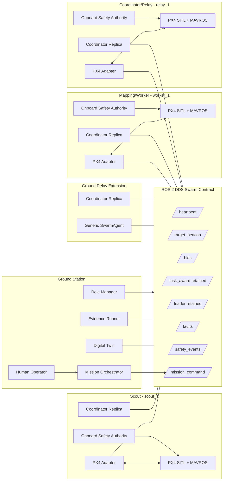

# EAGLE SWARM Operational Architecture

## Responsibility model



## Data flow

1. Every unit publishes a heartbeat with identity, role, state, battery, pose, link, capability and GPS health.
2. Initial election waits for stable expected membership (bounded by timeout), then all replicas compute the same weighted leader.
3. Coverage goals are sampled by a seeded, safety-gated planner and sent to all three aerial units.
4. RGB cueing creates a candidate; thermal confirmation publishes a retained target beacon.
5. Eligible members publish explainable bids.
6. Only the elected leader's coordinator replica publishes the retained task award.
7. The winning adapter executes the target setpoint; local safety may override it.
8. Fault and safety events feed both the Digital Twin and automated evidence runner.

## Onboard Safety Authority

The mission layer requests behavior; it does not own final flight authority. Each aerial adapter enforces this precedence:

```text
hard shutdown > land > critical-battery RTB > GPS/collision hold > mission > coverage
```

Consequences:

- a low-battery winner releases its task before returning;
- a GPS-invalid unit rejects new awards;
- a delayed separation hold cannot cancel landing;
- DDS loss does not immediately remove PX4 stabilization/setpoint streaming;
- non-winners return to their local launch points, not a shared global coordinate.

## Replicated coordinator

Four replicas (`scout_1`, `worker_1`, `relay_1`, `ground_relay`) consume the same heartbeat, target, bid and retained award state. Election uses battery, link quality, capability and a coordinator-role bonus. Deterministic ID tie-breaking prevents ambiguity. A replica publishes awards only when its owner equals the elected leader.

## Interfaces

| Type | Name | Purpose |
|---|---|---|
| Topic | `/swarm/heartbeat` | Health and membership |
| Topic | `/swarm/target_beacon` | Confirmed sensing event |
| Topic | `/swarm/bids` | Explainable Contract-Net offers |
| Topic | `/swarm/task_award` | Retained winner announcement |
| Topic | `/swarm/leader` | Retained elected authority and epoch |
| Topic | `/swarm/faults` | Detection, action and recovery time |
| Topic | `/swarm/safety_events` | Separation intervention and release |
| Topic | `/swarm/mission_command` | Sector, hold, resume, RTB, return-home and land |
| Service | `/swarm/request_role_change` | Single routed role update |
| Action | `/drone/<id>/go_to_target` | Heartbeat-gated transit bridge |

## Failure points and recovery

| Failure | Detection | Recovery | Residual limitation |
|---|---|---|---|
| Leader/Coordinator unit loss | heartbeat timeout and state loss | already-running replica becomes authority | one-host simulation remains a common-mode failure |
| Winner shutdown | timeout / SHUTDOWN | task reopened and re-awarded | failed airframe is not restarted |
| Critical battery | local threshold | release, RTB, land, re-auction | charging is modeled, not physical |
| Wi-Fi/DDS partition | heartbeat isolation | local safety continues; restore rejoins | partitioned member cannot receive global tasks |
| GPS dropout | health flag | local hold, award rejection, restore state | no VIO fallback in prototype |
| Collision risk | 3-D intervention and hard margins | deterministic hold/resume plus one-shot near-miss escalation | reactive rules rather than full ORCA |
| Dashboard loss | HTTP/process health | swarm remains independent | operator visibility is temporarily lost |
| False target cue | thermal confirmation and confidence gate | no beacon below threshold | deterministic perception, no model benchmark |
