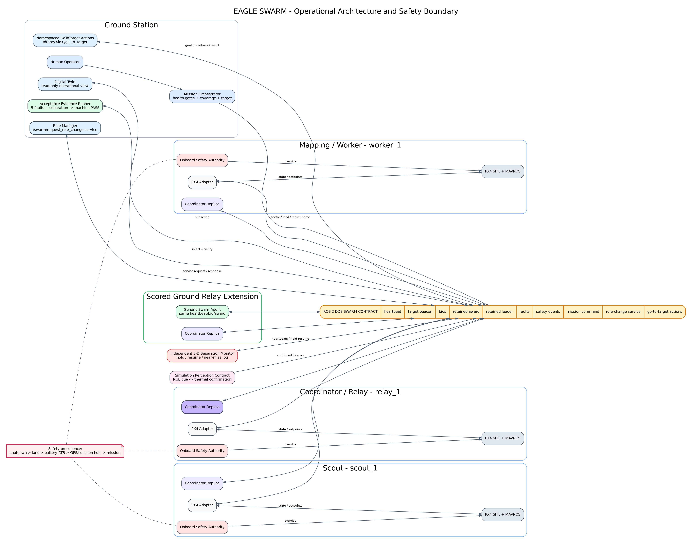

# Executive Summary

EAGLE SWARM is a runnable civilian reconnaissance-swarm prototype built around three independent PX4 SITL aircraft and one Ground Relay extension. ROS 2 DDS provides the high-level membership, sensing, allocation, leadership, fault and evidence contracts; MAVROS connects each aircraft to PX4; Gazebo supplies the physical simulation; and a browser Digital Twin provides live operational visibility.

The normal mission is deliberately end-to-end rather than a collection of disconnected nodes. The launcher waits for Gazebo, requires a confirmed collision-enabled target spawn and then waits for all three FCU links. Each aircraft takes off and hovers, then receives a reproducible constrained-random coverage waypoint. Only after all three reach their sectors does the mission create an RGB candidate cue. A separate thermal-confirmation stage publishes a target beacon. Four participants compute explainable Contract-Net bids. A replicated coordinator elects one authoritative owner and publishes the retained award. The winner flies to the physical target platform and lands directly on it, while non-winners return to their own launch positions and land.

Fault recovery is treated as executable acceptance evidence. A scenario runner injects the five mandatory faults, observes ROS state transitions, writes JSON and Markdown timelines, and fails unless the required detection, action and measured recovery conditions are observed. A sixth scored scenario creates controlled crossing paths and proves active separation intervention plus hysteretic release. This closes the common gap between implementing a fault branch and proving that it works in the integrated simulation.

The design intentionally does not claim trained perception accuracy. RGB cueing and thermal confirmation are deterministic simulation stages behind the same beacon interface that a production perception stack would use. This preserves engineering honesty while allowing the assessment to focus on distributed coordination, integration, safety and recovery.

## Assessment position

After a final clean build, one complete normal recording, five passing mandatory-fault artifacts and one passing separation-safety artifact, the strict projected rubric score is **92/100**. The strongest areas are architecture/extensibility, PX4 integration, task allocation, leader recovery, Digital Twin and Ground Relay reuse. The deliberate limitation is reactive separation rules rather than a fully validated ORCA implementation.

# 1. Assessment Scope and Design Principles

The prototype implements the required three aerial roles:

- **Scout (`scout_1`)** - long-range reconnaissance role and simulated target-cue source.
- **Mapping/Worker (`worker_1`)** - preferred routine task executor through a zero role penalty.
- **Coordinator/Relay (`relay_1`)** - high-quality link/capability member and expected initial leader.

A scored **Ground Relay (`ground_relay`)** joins the same DDS contract through a generic agent. It sends heartbeats, computes bids and can participate in leader election without adding platform-specific branches to the allocator.

The design follows six principles:

1. **Running evidence over prose.** A requirement is complete only when the source, launch path and evidence command agree.
2. **Local safety over global optimization.** Contract-Net can request motion, but battery, GPS, separation and landing precedence remain onboard.
3. **Deterministic distributed decisions.** Cost, election, tie-break and yielding policies are pure and testable.
4. **Constrained randomness.** Coverage appears non-scripted while retaining safety bounds and exact replay.
5. **Open/Closed extension.** New compliant robot types are added through configuration and adapters, not allocator rewrites.
6. **Honest limitations.** Deterministic perception and reactive separation are identified explicitly.

# 2. Operational Architecture

{ width=100% }

## 2.1 Package decomposition

| Package | Main responsibility | Failure containment |
|---|---|---|
| `eagle_swarm_common` | Pure coverage, cost, election and yielding policies | No ROS dependency; unit-testable |
| `eagle_swarm_msgs` | Stable swarm contract | Interface changes are explicit and reviewable |
| `eagle_swarm_core` | Mission, agents, coordination, role service and action servers | Replicated coordinator removes one process as a single point |
| `eagle_swarm_px4` | PX4/MAVROS translation and onboard safety boundary | Each aircraft fails independently |
| `eagle_swarm_sim` | Gazebo assets and separation monitor | Safety monitor is independent of allocator |
| `eagle_swarm_dashboard` | Operational visualization | Dashboard loss does not stop flight |
| `eagle_swarm_tools` | Fault injection, scenario verification and evidence summaries | Evidence is machine-generated |

## 2.2 DDS interfaces

| Type | Interface | Key payload |
|---|---|---|
| Topic | `/swarm/heartbeat` | ID, role, state, battery, pose, link, capability, GPS, timestamp |
| Topic | `/swarm/target_beacon` | target, position, confidence, urgency, sender, battery, confirmation source |
| Topic | `/swarm/bids` | distance, battery, role and link components, total, ETA, battery-after |
| Topic | `/swarm/task_award` | target, winner, assigning leader, winning cost, timestamp |
| Topic | `/swarm/leader` | leader ID, reason and election epoch |
| Topic | `/swarm/faults` | fault, robot, severity, action and recovery time |
| Topic | `/swarm/safety_events` | pair, separation, intervention and timestamp |
| Topic | `/swarm/mission_command` | sector, hold, resume, RTB, return-home and land commands |
| Service | `/swarm/request_role_change` | routed role-change request |
| Action | `/drone/<id>/go_to_target` | goal pose, safety margin, feedback and final result |

Target beacon, task award and leader state use retained/transient-local delivery. A newly authoritative replica therefore receives the current target and assignment state. Heartbeats remain volatile because stale health data must not be treated as current.

## 2.3 Onboard Safety Authority boundary

The PX4 adapter is more than a message converter. It is the aircraft-level safety authority. The precedence is:

```text
hard shutdown > landing > critical-battery RTB
> GPS/collision safe hold > task execution > coverage patrol
```

The consequences are operationally important:

- a low-battery winner releases its assignment before returning home;
- a GPS-invalid unit holds its local estimate and rejects new awards;
- collision hold/resume cannot cancel a landing command;
- an isolated DDS link suppresses swarm heartbeat, bids, awards and mission/role commands while the onboard PX4 setpoint stream and local safety state continue;
- a non-winning aircraft returns to its own local launch point, avoiding frame mistakes.

# 3. Integrated PX4 and Gazebo Mission

## 3.1 Health-gated startup

The launcher refuses to run over stale PX4 or Gazebo processes. It creates a timestamped log directory, starts vehicle 0 with Gazebo, waits for the world control service, adds vehicles 1 and 2 at separated spawn positions, starts a GCS heartbeat, starts one MAVROS bridge per PX4 instance and verifies `connected: true` on all three state topics. Only after these gates pass is the ROS swarm launch started.

This order prevents the mission from appearing to work while one aircraft is absent. The mission orchestrator independently waits until all three adapters report `ACTIVE` after takeoff and hover.

## 3.2 State sequence

```text
WAIT_FCU -> WAIT_POSE -> PRESTREAM -> ARMING -> TAKEOFF -> ACTIVE
ACTIVE -> COVERAGE -> SECTOR_READY
winner: EXECUTING -> ARRIVED -> LANDING -> LANDED
non-winners: SECTOR_READY -> RTB -> LANDING -> LANDED
```

The winner receives a direct land command at its actual target pose. During the PX4 mode transition, the adapter freezes the current setpoint and continues streaming only until PX4 leaves OFFBOARD. This removes the visually illogical climb that occurred when the old 3 m target setpoint remained active.

## 3.3 Physical target platform

The target is spawned at the same coordinates used by the beacon, default `(10, 0)`. The SDF includes matching visual and collision cylinders. A wide, low platform supports the x500 landing footprint and prevents the aircraft from passing through a visual-only marker.

# 4. Reproducible Random Coverage

Hard-coded parallel movement proves translation but does not communicate real partitioning. The final design samples one waypoint per robot inside a dedicated angular wedge:

| Robot | Launch point | Angular wedge |
|---|---:|---:|
| Scout | `(0, 0)` | `-15 to +15 deg` |
| Worker | `(0, 3)` | `+45 to +70 deg` |
| Relay | `(0, -3)` | `-70 to -45 deg` |

The radial step is 2.5-3.5 m. The pure planner samples all goals, calculates the minimum pairwise goal separation and rejects the set unless it is at least 2.8 m. A bounded retry count turns impossible configuration into a clear startup error rather than unsafe motion.

The seed is either supplied through `COVERAGE_SEED` or generated from time. The mission logs:

```text
RANDOM COVERAGE seed=<seed>; planned_min_separation=<d>m:
relay_1=(...), scout_1=(...), worker_1=(...)
```

This provides two useful modes: fresh natural-looking behavior during development and exact replay for the final video.

# 5. Target Confirmation and Perception Boundary

The assessment prototype separates cueing from confirmation:

1. all three aircraft must first report `SECTOR_READY`;
2. an RGB candidate cue is logged;
3. a separate thermal-confirmation delay completes;
4. a target beacon is published with confidence 0.94;
5. the coordinator ignores confidence below 0.75.

The design validates the sensor-to-swarm contract, including position, source, sender health and timestamp. It does not claim camera-model performance. A production replacement can subscribe to real RGB and thermal streams, perform calibration/registration and publish the same beacon only after fusion. Required production metrics are precision, recall, fused false-positive rate, localization error and confirmation latency.

This limitation is preferable to presenting a synthetic camera detector as evidence of field accuracy.

# 6. Contract-Net Task Allocation

Each eligible participant calculates:

```text
cost = distance
     + 0.4 * (100 - battery_percent)
     + role_penalty
     + 30 * (1 - link_quality)
```

Role penalties are:

| Role | Penalty |
|---|---:|
| Worker | 0 |
| Scout | 2 |
| Ground Relay | 5 |
| Coordinator | 8 |

Distance estimates response time. Battery protects endurance before the hard reserve threshold. Role penalty prevents routine tasks from consuming scarce coordination/reconnaissance resources unnecessarily. Link penalty strongly discourages a weak connection. Every component is published in the `Bid` message, and the coordinator chooses the lowest total with robot ID as a stable tie-break.

The weights are engineering policy parameters rather than learned values. They are transparent and suitable for later sensitivity analysis.

## 6.1 Assignment lifecycle

- Bids for assigned or completed targets are ignored.
- The assignment is stored before the award is published, preventing duplicate evaluation cycles.
- Every replica consumes the retained award.
- `ARRIVED` marks the target complete and suppresses later re-auction.
- RTB, landing, shutdown, safe hold or heartbeat loss make a winner unavailable and reopen the target when it is not complete.

# 7. Leader Election and Replicated Authority

One coordinator replica is launched for every aerial member and the Ground Relay. All replicas consume identical state and calculate the same score:

```text
0.5 * battery + 30 * link + 20 * capability + coordinator_role_bonus
```

The coordinator role receives an 8-point bonus. Ties use robot ID. Only the replica whose owner ID equals the elected leader may publish awards or authoritative leader/fault events.

## 7.1 Stable initial election

DDS discovery is incremental. Electing immediately when the first heartbeat arrives creates noisy transient leaders. The final coordinator waits until all expected members are visible, with a bounded 15-second timeout for a genuinely missing unit. It then performs the first election and logs stable membership. After initialization, normal heartbeat timeouts and state eligibility drive leader changes.

## 7.2 Coordinator-loss recovery

`coordinator_loss` is an explicit fault, not a label silently converted to another command. It stops the target aircraft's heartbeat/OFFBOARD stream and disables its colocated coordinator replica. Another already-running replica observes the timeout, elects a new leader, increments the epoch and publishes a measured `coordinator_loss_recovery` event. The acceptance runner injects after the first award and does not pass until the original or replacement task winner reaches `ARRIVED`, proving mission continuity rather than election alone. No full launch restart is involved.

# 8. Battery, RTB and Charging Rotation

The adapter combines MAVROS battery percentage with a virtual drain model, reporting the lower value. This guarantees observable depletion in SITL without overstating energy.

Motion drains faster than hover. At or below the reserve threshold (25% by default), local safety:

1. records the fault start;
2. clears the assigned target;
3. sets a home/hover waypoint;
4. changes state to `RTB`;
5. publishes a fault action;
6. allows the coordinator to reopen the target;
7. lands after reaching home;
8. reports measured completion time.

The automated critical-battery scenario injects the fault immediately after the first award. This timing proves actual reallocation rather than merely returning an idle aircraft.

# 9. Collision Avoidance

The independent monitor calculates 3-D pairwise distance for airborne aerial members only. Ground Relay and landed aircraft are excluded. Three margins create hysteresis:

- intervention margin: 2.6 m;
- hard safety / near-miss margin: 2.0 m;
- release margin: 3.2 m.

At intervention, a deterministic policy selects the yielding unit. If separation continues below the hard margin while the hold is active, a distinct `NEAR_MISS` escalation is logged exactly once for that episode. An executing target path is preserved over patrol/hold where possible; otherwise role priority and ID tie-breaking apply. The yielding aircraft receives `hold`. Once separation exceeds the release margin it receives `resume`. If a pair disappears because a member lands or times out, the held unit is released.

This is an active, demonstrable safety layer. It is intentionally described as separation rules rather than full ORCA/RVO. A production ORCA implementation would require velocity-obstacle modelling, vehicle dynamic constraints and extensive validation.

# 10. Ground Relay and Open/Closed Principle

The Ground Relay is created with the existing generic `SwarmAgent`. No allocation branch checks for a ground platform. The agent uses the same heartbeat, beacon, bid and award contracts and the same pure task-cost function. Its role penalty and capability are configuration.

This demonstrates Open/Closed behavior:

- the core allocator is closed to platform-specific modification;
- the system is open to a new robot through configuration and a compliant adapter;
- coordinator replication also includes the Ground Relay without a separate coordinator implementation.

# 11. Fault Injection and Machine-Checked Evidence

The assessment requires detection, recovery action and recovery-time measurement for five faults. The repository also machine-checks the scored collision-safety behavior instead of relying on a lucky normal-run encounter. Manual screenshots are vulnerable to timing errors and selective interpretation, so the final repository includes an acceptance runner.

The runner subscribes to heartbeats, leaders, awards, faults and safety events. It injects a scenario, selects the current winner/leader where appropriate, evaluates exact conditions and writes:

```text
evidence/runtime/campaign_<UTC>/
  normal/
  scenarios/<scenario>_<UTC>/
    PASS or FAIL
    EVIDENCE.md
    evidence.json
  RUNTIME_EVIDENCE_INDEX.{md,json}
```

## 11.1 Scenario acceptance conditions

| Scenario | Acceptance condition |
|---|---|
| Coordinator loss | leader changes, measured `coordinator_loss_recovery` appears and the allocated target still reaches `ARRIVED` |
| Winner shutdown | shutdown + heartbeat timeout + task release + different second award whose winner reaches `ARRIVED` |
| Critical battery | task release + different second award reaching `ARRIVED` + measured original-unit RTB/landing completion |
| Wi-Fi cut | cut event + restore event + heartbeat restored with measured outage |
| GPS dropout | safe hold + restore + GPS-valid resumed heartbeat + measured recovery |
| Separation safety | injected crossing goals + intervention/near-miss + hysteretic clear + both aircraft healthy |

`run_fault_campaign.sh` executes each destructive scenario in a fresh PX4/Gazebo run with a fixed seed. `run_separation_acceptance.sh` delays target cueing and creates controlled crossing goals. `run_full_acceptance_campaign.sh` stores the normal run and all six scored scenarios in one immutable timestamped campaign directory. `summarize_evidence` builds an overall index and marks it incomplete unless the normal milestones, all five mandatory fault PASS artifacts and the separation PASS artifact exist.

# 12. Digital Twin

The web dashboard presents:

- member role, state, battery, pose, link, capability and GPS health;
- leader identity, epoch and reason;
- target confirmation source and confidence;
- bid components and winning award;
- fault actions and recovery durations;
- safety intervention and release events.

The dashboard is read-only and outside the onboard safety boundary. Its failure removes operator visibility but does not stop the mission.

# 13. Safety and Cybersecurity

## 13.1 Safety controls

Implemented controls include health-gated arming, continuous setpoints, battery reserve, GPS safe hold, active separation, physical target collision geometry, protected landing and heartbeat-based task recovery. Production deployment adds hardware E-stop, watchdogs, PX4 geofences, redundant navigation, formal operating limits, HIL and staged flight testing.

## 13.2 Security controls

| Threat | Production control |
|---|---|
| Robot hijacking | DDS Security identities, encryption, governance and least privilege |
| Fake member | certificate allowlist and role authorization |
| Replay | sequence/timestamp validation and bounded message age |
| GPS spoofing | GNSS/VIO/INS consistency and safe hold |
| Firmware tampering | secure boot and signed artifacts |
| Ground-station compromise | segmented network, MFA, read-only dashboard and audit |
| Denial of service | QoS/rate limits, local safety autonomy and radio diversity |

The prototype is civilian sensing-only and contains no engagement logic.

# 14. Verification Strategy

## 14.1 Pure unit tests

Fifteen tests validate cost components and clamping, coordinator bonus, deterministic bid and leader tie-breaking, executing-path safety priority, coverage seed reproducibility, different-seed variation, angular/radial bounds, pairwise separation and invalid configuration rejection.

## 14.2 Static preflight

`preflight_submission.sh` checks:

- no patch backups or bytecode remain;
- source-only packaging (no build/install);
- Python compilation;
- package XML and SDF parsing;
- pure unit tests;
- Bash syntax;
- required PDFs/documents and the report page limit;
- required PDFs and documents.

## 14.3 Runtime evidence

A source-only GitHub Actions job repeats this preflight on every push or pull request. The final Ubuntu campaign must add:

- clean `colcon build` and `colcon test` logs;
- one normal run with `DEMO COMPLETE`;
- five fault PASS artifacts plus one separation-safety PASS artifact;
- generated overall evidence index;
- 15-minute video following the supplied script.

The packaging environment used to finalize this report does not include ROS/PX4/Gazebo, so it does not claim those final runs. Baseline candidate-machine logs confirm the integration path and are included as selected excerpts.

# 15. Known Limitations and Trade-offs

1. **Perception:** deterministic cue/confirmation contract, not model benchmarking.
2. **Separation:** active reactive rules, not full ORCA.
3. **Network:** logical DDS partition, not RF channel emulation.
4. **Navigation:** GPS dropout holds local estimate; no VIO fallback.
5. **Battery:** virtual drain and charging rotation; no physical charger.
6. **Common-mode host:** all simulation processes run on one machine.
7. **Cost weights:** explainable engineering values, not field-calibrated optimization.
8. **Restartability:** member/leader recovery is shown; full host/process supervisor restart is future work.

These limitations are bounded and documented rather than hidden.

# 16. Strict Rubric Forecast

| Rubric | Forecast |
|---|---:|
| Architecture & Extensibility | 12/12 |
| ROS 2 Code Quality | 9/10 |
| PX4/Gazebo Integration | 10/10 |
| Swarm Communication | 9/10 |
| Coverage / Task Allocation | 10/10 |
| Leader Election | 10/10 |
| Battery & RTB | 8/8 |
| Collision Safety | 7/8 |
| Digital Twin | 8/8 |
| Ground Relay Extension | 8/8 |
| Documentation & Demo | 6/6 |
| **Projected total after passing evidence campaign** | **92/100** |

The score should be reduced if any mandatory fault artifact, final build/test result or complete landing sequence is absent.

# 17. Reproduction Commands

Normal run:

```bash
cd ~/eagle_swarm_ws
source /opt/ros/humble/setup.bash
rm -rf build install log
rosdep install --from-paths src --ignore-src -r -y
colcon build --symlink-install
source install/setup.bash
COVERAGE_SEED=2180021560 ./scripts/start_integrated_demo.sh
```

Full acceptance campaign:

```bash
./scripts/run_full_acceptance_campaign.sh
```

Strict final gate (dependencies, clean build, tests, full runtime campaign, evidence index and clean ZIP):

```bash
./scripts/final_submission_gate.sh
```

# Conclusion

The final EAGLE SWARM workspace demonstrates systems engineering rather than isolated algorithm implementation. It connects three PX4 aircraft, safe randomized coverage, staged sensing, explainable allocation, replicated leadership, onboard safety authority, Ground Relay extensibility, active separation, a Digital Twin and automated fault evidence into one coherent platform. The remaining work is intentionally procedural: run the supplied final build, evidence campaign and video on the candidate Ubuntu machine and submit the generated artifacts with the exact source revision.
